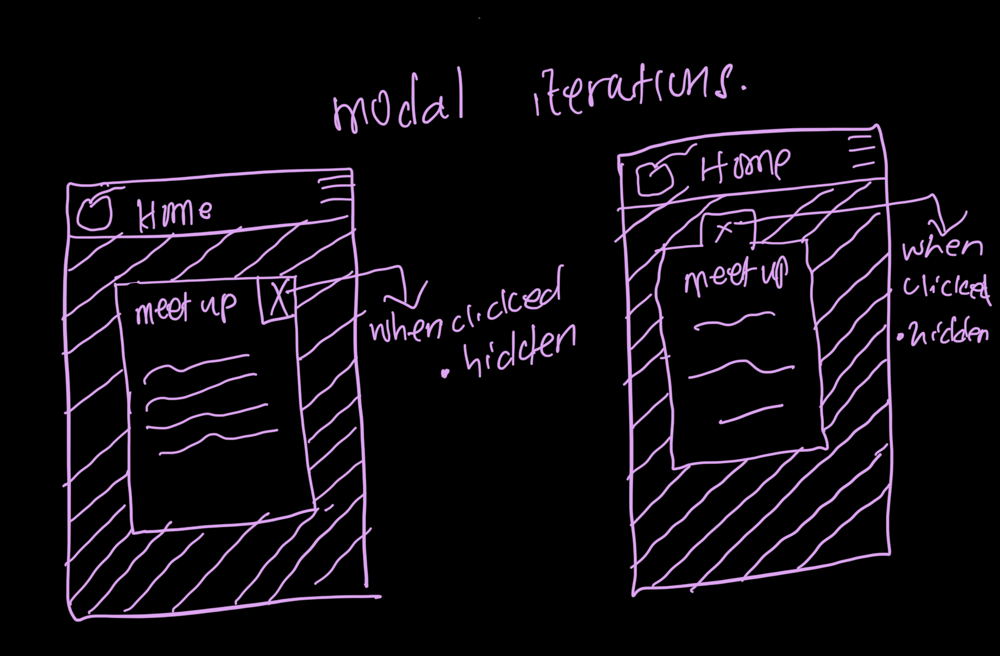
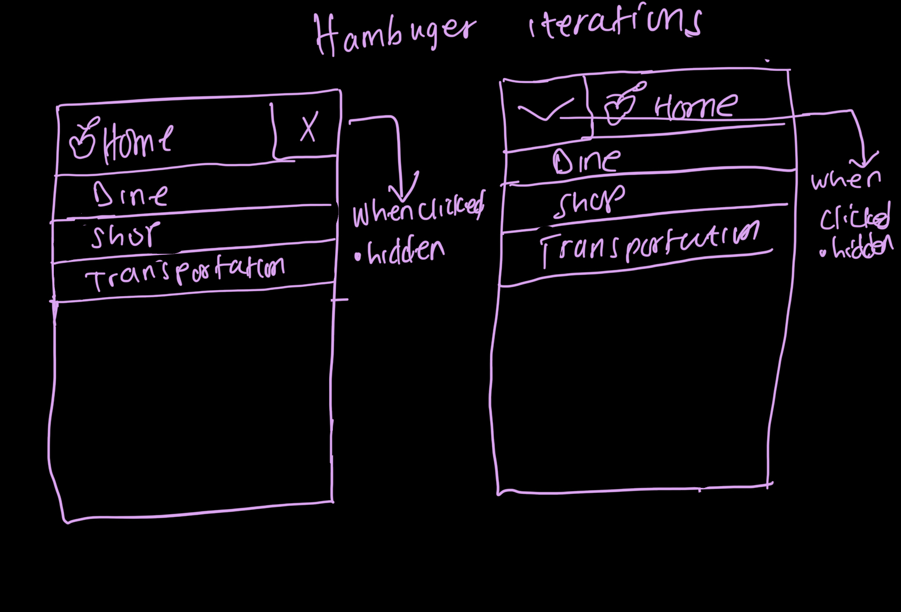
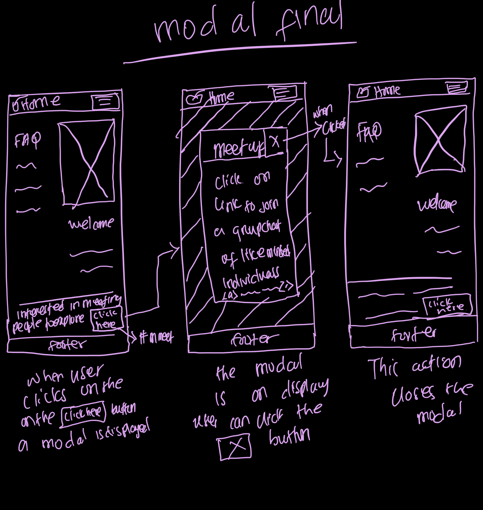
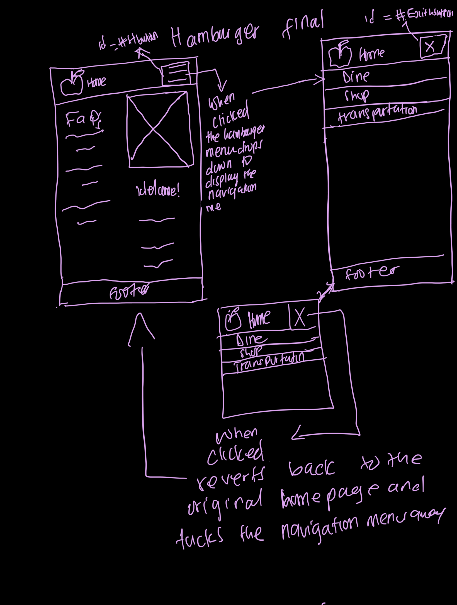

# Apple Harvest Festival Website
[Live website - Applefest](https://jemimahosei.github.io/Applefest/)

## Overview
This project involves the development of a website for the Apple Harvest Festival in Ithaca, aimed at enhancing user experience for college students. The initial version provides essential information about the festival, while subsequent modifications introduce interactive features to improve engagement.
<link to the final website >

## Understanding Users
From conducting three user interviews, I deduced the following goals:

### User Goals
1. **Partake in and enjoy activities**
   - **Design Ideas**:
     - Provide a clear and visible list of all activities happening at the festival.
     - Display available payment options.
   - **Rationale**: A comprehensive list of scheduled events offers attendees a plethora of options to explore.

2. **Purchase apples and other goods**
   - **Design Ideas**:
     - Include images and names of apple varieties and other available products.
     - Detail payment options.
   - **Rationale**: Including images aids decision-making, and detailing payment options ensures transparency and convenience.

3. **Socialize and enjoy food**
   - **Design Ideas**:
     - Provide entertainment options like musical performances and group activities.
     - Show images of food varieties.
   - **Rationale**: Engaging entertainment options enhance the event experience, while appealing visuals of food entice attendees.

### Audience
The target audience comprises college students residing in Ithaca, who share a common interest in apples. Their enthusiasm for apple-related experiences motivates their attendance at the festival.

### Content Organization
After reviewing similar sites and conducting iterations of card sorting, I decided on the following content structure:

- Home
- Shop
- Dine
- Events
- Transportation

This organization ensures clarity, allowing users to easily navigate to specific information.
 

 
## Visual Theme
I chose a **Vibrant and Colorful** theme to align with the festival's lively atmosphere. Bold colors and energetic graphics appeal to the youthful nature of the target audience.

## User Testing
I conducted user testing to verify the website's effectiveness in meeting audience goals. Feedback confirmed that the site provided necessary information and maintained clear navigation.

### Final Design
The final design features essential content for a successful experience at the festival, using a vibrant color scheme to engage users and reflect the festival spirit.

## Enhanced Functionality
The subsequent section of the project modified the original design by adding interactive features to improve user engagement.

### Interactivity Design
- **Event/Activity Planner**: Users can create personalized schedules for activities.
- **Social Meetup Board**: A virtual bulletin board for attendees to connect and socialize.

### Interactivity Design Ideation



### Final Interactivity Design Sketches
- **Modal Design**: 
- **Hamburger Menu Design**: 

### Interactivity Rationale
The proposed hamburger menu declutters the interface, enhancing navigation. The modal feature allows users to connect easily, aligning with their goals of engaging in activities and meeting new people.

## Interactivity Implementation Plan
**Modal Pseudocode:**
```javascript
// Open the modal
When the user clicks on the modal button (#mmeet):
    Remove the .hidden class from the modal overlay (#modal) to display it

// Close the modal
When the user clicks on the exit button inside the modal (#eexit):
    Add the .hidden class to the modal overlay (#modal) to hide it
