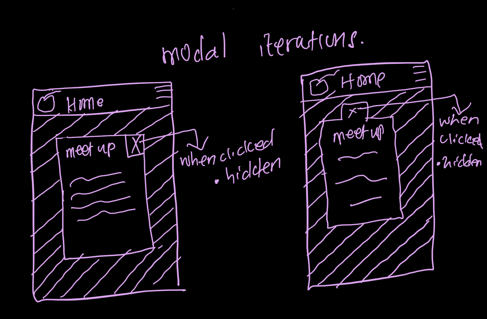
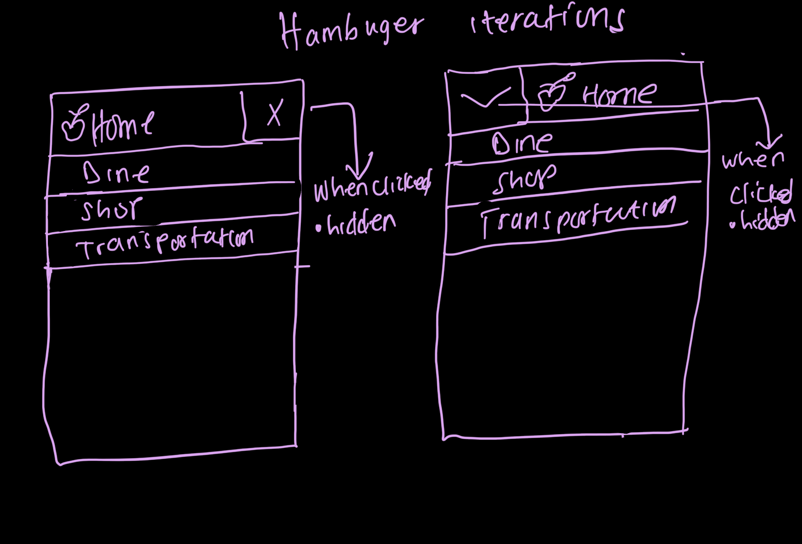
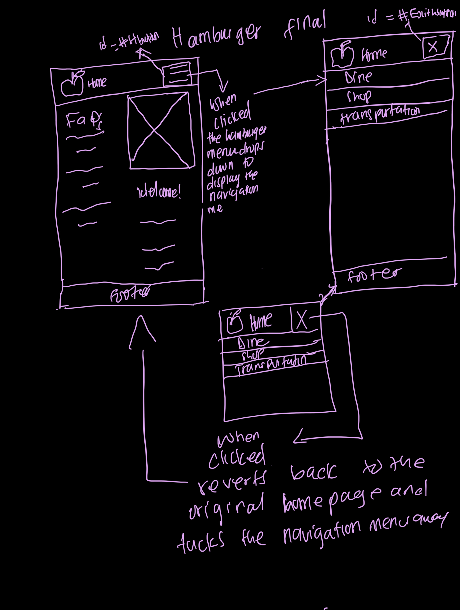

# Project 3: Design Journey

**For each milestone, complete only the sections that are labeled with that milestone.** Refine all sections before the final submission.

You are graded on your design process. If you later need to update your plan, **do not delete the original plan, leave it in place and append your new plan _below_ the original.** Then explain why you are changing your plan. Any time you update your plan, you're documenting your design process!

**Replace ALL _TODOs_ with your work.** (There should be no TODOs in the final submission.)

Be clear and concise in your writing. Bullets points are encouraged.

Place all design journey images inside the "design-plan" folder and then link them in Markdown so that they are visible in Markdown Preview.

**Everything, including images, must be visible in _Markdown: Open Preview_.** If it's not visible in the Markdown preview, then we can't grade it. We also can't give you partial credit either. **Please make sure your design journey should is easy to read for the grader;** in Markdown preview the question _and_ answer should have a blank line between them.


## Existing Project (Milestone 1)

**Tell us about the project you'll be using for Project 3.**

### Project (Milestone 1)
> Which project will you add interactivity to enhance the site's functionality?

> I will be working on Project (2)


### Audience (Milestone 1)
> Briefly explain your site's audience. (1-2 sentences)
> Be specific and justify why this audience is a **cohesive** group.

> The target audience for my website comprises college students residing in Ithaca. Through interviews, it was discovered that both  a junior from Ithaca College and a sophomore from Cornell University share a common interest in apples. Their enthusiasm for everything related to apples motivated them to attend the festival, where they aim to explore the different apple varieties and other offerings.


### Audience's Goals (Milestone 1)
> List the audience's goals that you identified in Project 1 or 2.
> Simply list each goal. No need to include the "Design Ideas and Choices", etc.
> You may adjust the goals if necessary.

- Goal 1: partake in and enjoy activites
- Goal 2:purchase apples and other goods
- Goal 3:socialize and enjoy food


## Interactivity Design (Milestone 1)

### Modal Interactivity Brainstorm (Milestone 1)
> Using the audience goals you identified, brainstorm possible options for **modal** interactivity to enhance the functionality of the site while also assisting the audience with their goals.
> Briefly explain each idea and provide a brief rationale for how the interactivity enhances the site's functionality for the audience. (1 sentence)
> Note: You may find it easier to sketch for brainstorming. That's fine too. Do whatever you need to do to explore your ideas.


> - Event/Activity Planner:  Allow users to create personalized schedules by selecting the activities they're interested in attending. This helps them maximize their enjoyment of the festival by ensuring they don't miss out on any preferred activities.

> - Social Meetup Board: Implement a virtual bulletin board where users can post and join meetups with other attendees interested in socializing. This encourages connections between users with similar interests and enhances their overall festival experience.


### Interactivity Design Ideation (Milestone 1)
> Explore the possible design solutions for the interactivity.
> Sketch at least two iterations of the modal and at least two iterations of the hamburger menu interactivity.
> Annotate each sketch explaining what happens when a user takes an action. (e.g. When user clicks this, something else appears.)






### Final Interactivity Design Sketches (Milestone 1)
> Create _polished_ sketch(es) (it's still a sketch, but with a little more care taken to communicate ideas clearly to the graders) to plan your interactivity.
> **Sketch out the entire page where your interactivity will go.**
> Include your interactivity to the sketch(es).
> Add annotations to explain what happens when the user takes an action.
> Include as many sketches as necessary to communicate your design (ask yourself, could another 1300 take these sketches an implement my design?)

**Modal design sketches:**


**Hamburger drop-down navigation menu design sketches:**


### Interactivity Rationale (Milestone 1)
> Describe the purpose of your proposed interactivity.
> Provide a brief rationale explaining how your proposed interactivity addresses the goals of your site's audience.
> This should be about a paragraph. (2-4 sentences)

>The proposed hamburger menu interactivity aims to enhance user experience for the narrow form of the Apple Festival page by decluttering the interface and providing easy access to navigation options when needed. This design solution ensures that users can navigate the festival website efficiently, aligning with their goals of partaking in activities, purchasing goods, and socializing. Additionally, the modal interactivity fosters the audience's goal of meeting new people by providing a convenient way for users to join a group chat of like-minded individuals directly from the homepage. Together, these interactivities contribute to a seamless and engaging experience for attendees of the festival.


## Interactivity Implementation Plan (Milestone 1)

### Interactivity Planning Sketches (Milestone 1)
> Produce planning sketches that include all the details another 1300 student would need to implement your interactivity design.
> Your planning sketches should include _all_ HTML elements needed for the interactivity; _annotations_ for the element types, their unique IDs, and CSS classes; and lastly the initial CSS classes.

**Modal planning sketches:**


**Hamburger drop-down navigation menu planning sketches:**


### Interactivity Pseudocode Plan (Milestone 1)
> Write your interactivity pseudocode plan here.
> Pseudocode is not JavaScript. Do not put JavaScript code here.

**Modal pseudocode:**

Open the modal:
```
 When the user clicks on the modal button (#mmeet):
 Remove the .hidden class from the modal overlay (#modal) to display it
```

Close the modal:
```
When the user clicks on the exit button inside the modal (#eexit):
Add the .hidden class to the modal overlay (#modal) to hide it
```


**Hamburger menu pseudocode:**

Pseudocode to show/hide (toggle) the navigation menu (narrow screens):
```
 When the user clicks on the hamburger menu button (#hbutton):
    If the navigation menu (#navmenu) has the .hidden class:
        Remove the .hidden class from the navigation menu to show it
    Else:
        Add the .hidden class to the navigation menu to hide it with animation.

```
Pseudocode to hide the hamburger button and show the navigation bar when the window is resized too wide:
```
When the window width is greater than a certain threshold (>600px):
Add the .hidden class to the hamburger menu button (#hbutton).
Remove the .hidden class from the navigation bar (#navmenu) if it's hidden.
```

Pseudocode to show the hamburger button and hide the navigation menu when the window is resized too narrow:
```
When the window width is less than a certain threshold (>600px):
    Remove the .hidden class from the hamburger menu button (#hbutton).
    Add the .hidden class to the navigation bar (#navmenu) if it's visible.
```
## Grading (Final Submission)

### Interactivity Usability Justification (Final Submission)
> Explain how your design effectively uses affordances, visibility, feedback, and familiarity.
> Write a paragraph (3-5 sentences)

TODO: interactivity rationale


### Tell Us What to Grade (Final Submission)
> We aren't re-grading your Project 1 or 2.
> We are only grading the interactivity you added.
> Tell us where (what pages) we can find your interactivity and how to use it.
> **We will only grade what you list here;** if it's not listed, we won't grade it.

TODO: what should we grade


### Collaborators (Final Submission)
> List any persons you collaborated with on this project.

TODO: list your collaborators


### Reference Resources (Final Submission)
> Please cite any external resources you referenced in the creation of your project.
> (i.e. W3Schools, StackOverflow, Mozilla, etc.)

TODO: list reference resources


### Self-Reflection (Final Submission)
> This was the first project in this class where you coded some JavaScript. What did you learn from this experience?

TODO: self-reflection


> Take some time here to reflect on how much you've learned since you started this class. It's often easy to ignore our own progress. Take a moment and think about your accomplishments in this class. Hopefully you'll recognize that you've accomplished a lot and that you should be very proud of those accomplishments!

TODO: self-reflection
